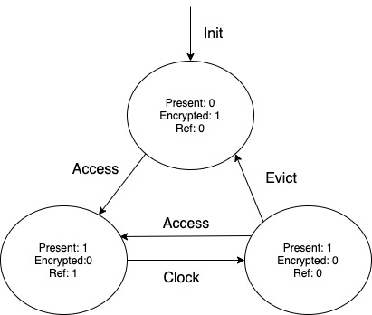
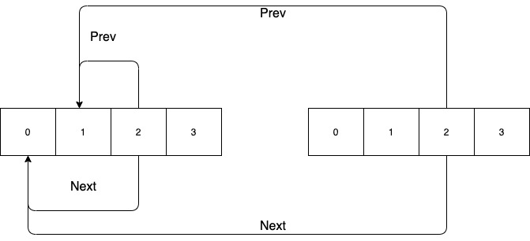
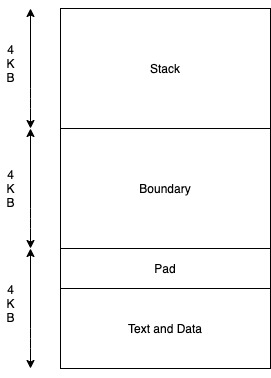

# COMP SCI 537 DIS-313 Week 11
Contents:
- P6 Spec Overview
  - Clock Algorithm
  - Tips
- P6 Background
  - Exec Function

References:
- Chapter 2 and 3 of xv6 reference [book](https://pdos.csail.mit.edu/6.828/2014/xv6/book-rev8.pdf)

Updates:
1. Rephrase the clock algorithm to make it compitable to both ring buffer and linked list implementation.
2. We encourages to use the hardware access bit instead of mannually maintaining it. Update the corresponing part:
   1. Removing the description of PTE_V
   2. Update the state diagram when ref bit is zero. With hardware-maintained bit, we don't need to clear the present bit at this time.
3. Add more detailed descrition about linked list copy.
4. Several minor type fixed.

## P6 Spec Overview
Remembering in P5, the user takes the responsibility to encrypt those pages. This time in P6, we will handle over the responsibility to the kernel. The core idea is to have as much as possible pages encrypted to mimize the chance being attacked. But making all the pages encrypted will largely harm the performance. Therefore, a better idea is to only maintain a working set of pages in clear text for each process. A few important points here:
1. Maintain the working set separately for each process not globally.
2. The size of the working set is predefined as a constant CLOCKSIZE. You should add this constant to the `param.h` following the instruction in the spec.

The general idea could be summaried as folllowing:
1. All the user pages should be encrypted when allocated. You don't need to care about kernel pages. This includes the text page which contains the program code and also the stack pages where the program stack resides. 
2. And once a user page is accessed, the page fault will be triggered (as we did in P5). This time we will not only decrypte but also add it into a queue which maintains all the decrypted pages. If this queue is full, then we will evict one page by running a so called clock algorithm.
3. This page will only be encrypted again until it is evicted from the queue.

### Clock Algorithm 
The clock algorithm is also named FIFO second-chance algorithm. So simply speaking, it's an FIFO-based algorithm that is used to approximate LRU in practice. 

<del>In order to implement this algorithm, we need to have one extra reference bit maybe named PTE_R to keep track whether this page has recently been accessed. There is also a hardware access bit you can use in xv6. </del> 

In order to implement this algorithm, we need to one extra bit to keep track whether this page has been recently accessed. Lucily, the hardware has already done this for you using an access bit (6th bit). This bit can be cleared by the kernel and reset automatically when access.
~~~[c]
#define PTE_A           0x020 // This field is maintained by the hardware
~~~
The idea is as following:
1. When a page is decrypted, it will be added to the tail of the queue. The reference bit is set to one at this time.
2. <del>When we want to find a victim page to evict, we pop the head of the queue.</del>
   When we want to find the a victim page to evict, we check the clock hand (head of the queue).
     - If the reference bit of this page is 0, then evict this page.
     - Otherwise, we set its reference bit to 0 and <del>push</del> move it to the back of the queue(that's why we call it second-chance).
3. <del>Repeat step 2 until we find the victim pages to evict.</del> Repeat step 2 by moving the clock hand to the next one in the queue until we find the victim pages to evict.

Check the spec for more example. Note that a page might be deallocated by the user, when it's on the queue, in this case, simply remove it from the queue.

### Tips
Hopefully, through P5, we have already known how to encrypt/decrypt a page and also how to manipulate the page table (read or modify pte). In addition, we also learn how to handle the page fault in trap handler. You can reuse part of the P5 code, if you want. Therefore, in P6, we will focuse on implementing the clock algorithm mechanism. A few thing you might need to modify:
1. `struch proc` is used to maintain per-process data. We don't want to restrict you to specific implementation. The following sample code is two ways of allocating the clock queue.
  ```
  // Ring Buffer
  struct proc {
    ...
    // Updated: Fix typo: Change node_t to pte_t
    pte_t clockQ[CLOCKSIZE];       // Used as a ring buffer
    uint head;                  // Head of the queue
  }


  // Linked List 
  typedef struct node {
    struct node *next;
    struct node *prev;
    pde_t *v; // Maybe vaddr here
  } node_t;

  struct proc {
    ...
    node_t clockQ[CLOCKSIZE];       // Locally allocated Clock Queue 
    node_t *head;                  // Double-linked List Queue
  }

  ```
  **UPDATE:** Both ways of implementation has its pros and cons:
  1. Removing element from a ring buffer involves shifting the element around while it could be easier to implement and copy.
  2. Implement and copy a linked list might be tricky but it will be easier to remove elements from the linked list.
  So just go with what make you comfortable to implement and both of them should be doable.
2. `growproc` in `vm.c` and `exec` in `exec.c` might be a good place to encrypt all the USER pages when they are allocated. Altough there are many ways you can achieve this, you need to be aware that some other functions (e.g. `allocuvm` or  `mappages`) will also be used to allocate kernel pages.
3. Now we have three possible states for a page table entry. Below is a figure might help you to better understand this. <del>You might notice that there is a state we have all the bits as 0. This saying that we couldn't distinguish it between an invalid page without looking into other information. There are many ways to solve this problem. Adding an extra PTE_V is one of the option. </del> Figure is updated: Present bit is 1 and ref is 0 when we are using the hardware-maintained bit.
      
      
4. **Update**: If you are maintaining linked list as you clock queue, don't simply copy the pointer (shallow copy) when you copy the clock queue from the parent process. Copy the pointer will make your memory look as following at the end.
      
You should do a deep copy instead which means that you should make your pointer points to the corresponding position in child process's clock queue. For instance, as shown in the figure, if the node at index 2 points to node at index 1 as its previous node. Then correspondingly, in your child process clock queue, you should let the node at index 2 point to the node at index 1 at child's clock queue.
5. Be sure to modify the Makefile before running the test:
   1. Modify `-O2` to `-O0`. Any other flag except `-O0` will let the compiler do some amount of optimization which will make the test not work.
   2. Modify CPU to 1 
## P6 Background
### Exec
Exec is a function which do all the setup works before running a user program. All the user program includes `init` and `sh` are run by the `exec`. These setup works includes
1. Copy the code text from the file system into the memory. The text and data for the progam is placed normally starting from virtual address 0.
2. Allocate one stack page two pages above the text and data pages. Copy all the argument into the stack.

<del>The layout looks as following</del> The layout might look as following if the program text and data is one-page:

  
  
All the pages above are heap-allocated page which could be allocated by calling `sbrk` syscall (used in `malloc`).

An intuitive way to encrypt those text and stack pages are right after they are set-up which should be somewhere at the end of the `exec` function.

~~~[c]
int
exec(char *path, char **argv)
{
  ...
  // Load program into memory.
  sz = 0;
  for(i=0, off=elf.phoff; i<elf.phnum; i++, off+=sizeof(ph)){
    ...
    // Allocate page for the program text pages
    if((sz = allocuvm(pgdir, sz, ph.vaddr + ph.memsz)) == 0)
      goto bad;
    ...
    // Load the program into the memory
    if(loaduvm(pgdir, (char*)ph.vaddr, ip, ph.off, ph.filesz) < 0)
      goto bad;
  }
  ...

  // Pad the text and data page to a full page
  sz = PGROUNDUP(sz);

  // Allocate two pages at the next page boundary.
  // Make the first inaccessible.  Use the second as the user stack.
  if((sz = allocuvm(pgdir, sz, sz + 2*PGSIZE)) == 0)
    goto bad;
  clearpteu(pgdir, (char*)(sz - 2*PGSIZE));
  sp = sz;

  // Push argument strings, prepare rest of stack in ustack.
  ...

  // Commit to the user image.
  oldpgdir = curproc->pgdir;
  curproc->pgdir = pgdir;
  curproc->sz = sz;
  curproc->tf->eip = elf.entry;  // main
  curproc->tf->esp = sp;
  switchuvm(curproc);
  freevm(oldpgdir);
  return 0;

 bad:
  ...
}
~~~